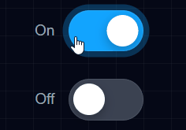

# Toggle Components

A minimal UI component study focused on simple on/off interaction.

## Preview

## What this demonstrates

- toggle state interaction (on/off)
- smooth motion and visual feedback
- clean component structure

## Why I built this

I wanted to isolate a single UI interaction and focus on how it behaves, rather than embedding it inside a larger interface.
